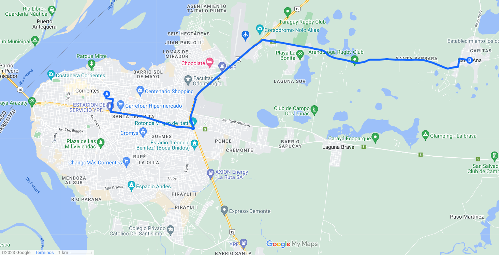

## Tramo 1 

Este tramo posiblemente lo tengas que hacer el día que llegues a Corrientes con tu **vuelo**. 

- `A - Punto Inicial` : Aeropuerto Corrientes
- `B - Punto Final` : Corrientes Capital (Puerto)


El puerto es una especie de punto de transbordo donde pasan muchas lineas de colectivo

*También puede servirte para volver, en ese caso es el mismo recorrido a la inversa.


```{r, echo=FALSE, out.width="100%", out.height="100%", fig.align="center", warning=FALSE}

knitr::include_graphics("Tramo_1.jpg")

```

- Si hacés click [acá](https://www.google.com/maps/d/u/0/edit?mid=14yclcIOdShYnqL84OrAft0Vo2pwZBNg&usp=sharing) te lleva al mapa interactivo con el recorrido indicado

- En este [link](https://drive.google.com/drive/folders/150U7I94ZKGDyWtismlI6OclBnSMAlieZ) vas a una carpeta de drive con todos los horarios para ese recorrido


<p>&nbsp;</p>
<p>&nbsp;</p>

## Tramo 2

Este es el segundo tramo que posiblemente tengas que hacer, para volver desde el **after** que será en San Cosme (casa de Pau) hacia Corrientes Capital. 

En el camino podés bajarte en el aeropuerto de Corrientes, en caso de que tu vuelo salga el domingo. O sea, te sirve también para ir al aeropuerto post after.


- `A - Punto Inicial` : San Cosme (after)
- `B - Punto Intermedio (opcional)` : Aeropuerto Corrientes
- `C - Punto Final` : Corrientes Capital (Puerto)


```{r, echo=FALSE, out.width="100%", out.height="100%", fig.align="center", warning=FALSE}

knitr::include_graphics("Tramo_2.jpg")

```

- Si hacés click [acá](https://www.google.com/maps/d/u/0/edit?mid=1iOKYW-U9lDFrB1Cp5oPKMqfdbPu5Ki8&usp=sharing) te lleva al mapa interactivo con el recorrido indicado

- En este [link](https://drive.google.com/drive/folders/17Lzp6r2kCCQIeY8pb3HpSNCS2DWXJng7?usp=sharing) vas a una carpeta de drive con todos los horarios para ese recorrido y los contactos para reservar las combis


<p>&nbsp;</p>
**Algo muy importante**, la casa de Pau queda muy cerca de Paso de la Patría, otra localidad a lado, entonces el punto inical puede ser San Cosme o Paso de la Patria, cualquiera está ok. En el drive vas a encontrar estas opciones también :)


**Aclaraciones útiles**: 

Para viajar en cualquier horario de combi de cualquier empresa y de cualquiera de los dos pueblos (San Cosme o Paso de la Patria) SI O SI hay que RESERVAR LUGAR CON UN MÍNIMO DE 24HS DE ANTICIPACIÓN . Para el colectivo NO se reserva lugar.


<p>&nbsp;</p>
<p>&nbsp;</p>

## Tramo 3

En caso de que vayas a la **quinta** que alquilaron las novias el domingo, vas a necesitar hacer este tramo, si estás en Corrientes o para volver desde la quinta a Corrientes cuando se termine la cosa.


- `A - Punto Inicial` : Corrientes Capital (Puerto)
- `B - Punto Final` : Santa Ana - (quinta Agus y Meli)


```{r, echo=FALSE, out.width="100%", out.height="100%", fig.align="center", warning=FALSE}



```

- Si hacés click [acá](https://www.google.com/maps/d/u/0/edit?mid=1gTYa5ja9x6udC4FgLjPeF6SDkTWTPdM&usp=sharing) te lleva al mapa interactivo con el recorrido indicado

- En este [link](https://drive.google.com/drive/folders/165L_b05tDzfCrMZYuTOixdNkZ5tywI1E?usp=share_link) vas a una carpeta de drive con todos los horarios para ese recorrido


<p>&nbsp;</p>

**Aclaraciones útiles:**

*Empresa ERSA , el pasaje cuesta $290 se puede abonar por Mercado Pago o Efectivo

*En la segunda imagen (la que tiene un carpinchito) vas a encontrar a la Empresa ERSA "Línea 109" mas la empresa SANTA ANA "Línea 11".
El colectivo 11 se abona ÚNICAMENTE EN EFECTIVO. 

*Donde dice "Ingenio" se refiere un paraje rural de Santa Ana.


<p>&nbsp;</p>
<p>&nbsp;</p>

## Adicional

Si tenés horarios de vuelo y **querés buscar amigues** que lleguen o partan en horarios cercanos para ponerse de acuerdo, en este [link](https://drive.google.com/drive/folders/1fGEELdPbhhXSrTQfHYPj08H2zo-Nhi2b?usp=share_link) está una grilla con todos los horarios de quienes vamos. Tal vez puedas ponerte de acuerdo y coordinar y... quien sabe... tal vez conocer al amor de tu vida...


